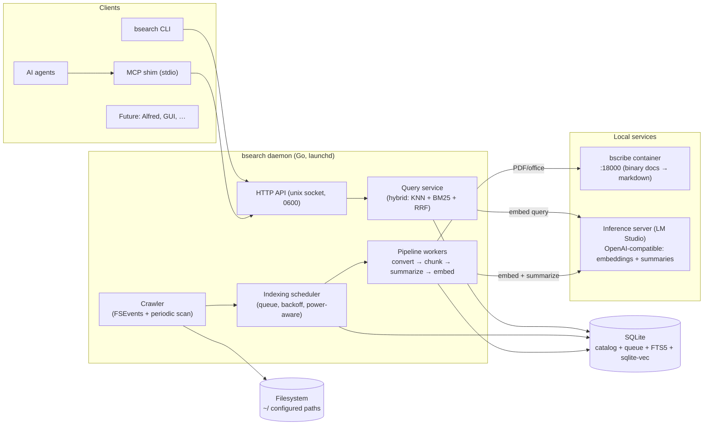

# bsearch — Design

| | |
|---|---|
| Author | Ben Crisp (ben@thecrisp.io) |
| Status | Draft |
| Created | 2026-07-19 |
| Updated | 2026-07-19 |

## Objective

bsearch indexes the files on your Mac — documents, PDFs, emails, images — and
lets you and your AI tools search them semantically, entirely locally.

## Background

Two motivations, honestly ranked: this is a fun project first, and a practical
one second.

The practical need: AI agents (Claude Code and similar) work dramatically
better with relevant context, but that context is scattered across the
filesystem in different formats — markdown notes, PDFs, office documents,
emails, images. There is no good local way to say "find me the documents
relevant to X" and hand results to an agent. Spotlight is keyword/metadata
search only — no semantic retrieval.

Prior art, own: `lore`, a semantic search engine for my Obsidian wiki,
vibe-coded quickly and now hard to maintain — I've lost the mental model of how
it fits together. It also has a design flaw worth fixing: it indexes
new/modified files at query time, adding user-visible lag, with no background
indexing. bsearch starts fresh rather than extending lore, with lessons carried
over: index ahead of time in the background; keep the design documented (this
doc) so the mental model survives.

## Goals

- **Give AI agents cheap access to local context.** An agent should be able to
  find the documents relevant to a task and pull them into context with minimal
  context-window spend — summaries first, full content on demand.
- **Find anything by meaning.** Any supported document on the machine is
  findable by describing what it's about, not by remembering filenames or
  keywords. Search must feel snappy — indexing happens in the background and is
  allowed to be slow; query speed is what the user experiences. Retrieval
  quality beats pure-vector: semantic and keyword signals combine (hybrid
  search).
- **Nothing leaves the machine.** Content, embeddings, queries, and metadata
  stay on-device. Privacy and data sovereignty are goals in their own right,
  not side effects of the architecture.
- **Stay understandable for years.** The design must survive long gaps between
  hacking sessions. Boring choices, documented decisions, clear boundaries —
  explicitly the anti-`lore` goal.

## Non-goals

- **No multi-user support.** Single user, single machine. There is no concept
  of accounts, tenants, or sharing.
- **No bundled inference.** bsearch never runs models itself — you bring an
  inference server (Ollama, LM Studio, vLLM, …) speaking a standard protocol.
  Keeps bsearch small and lets the model stack evolve independently.
- **No remote access by default.** The API listens locally only. Exposing it
  (e.g. over Tailscale) is a deliberate user action, not a supported default.
- **No commercial ambitions.** Personal tool, open source. No hosted version,
  no telemetry, no growth features.
- **Not cross-platform in v1.** Designed for Apple Silicon macOS. Nothing
  should gratuitously block Linux later, but no effort is spent on it.
- **No cloud sync or backup of the index.** The index is derived data; it can
  always be rebuilt from local files.
- **No cloud sources.** Gmail, Drive, Notion, web pages — out of scope.
  bsearch indexes the local filesystem only (Apple Mail counts: its store is
  local files).

## Missing features (deferred, wanted eventually)

- **Native macOS frontend.** A Swift menu-bar/settings app for monitoring
  indexing progress and editing config. Consequence: v1 is configured by file
  and observed via CLI (`bsearch status`).
- **Image indexing.** Text search over images via a vision model (captioning +
  embedding). Consequence: v1 indexes text-bearing documents only; the
  ingestion pipeline must still be designed so a new media type slots in as
  another converter, not a rework.
- **Email (Apple Mail).** Parsing the local Mail store. Consequence: v1 leaves
  a major personal corpus unsearchable; the crawler design must not assume
  "documents are files a user saved" (mail messages are many small files in a
  library directory).
- **Third-party integrations** (Alfred, Raycast, etc.). Consequence: none for
  v1 — the local API is the integration surface; anyone can build these later.

## Scenarios

### 1. Agent pulls context (primary)

Ben asks Claude Code to review his mortgage options. The agent calls bsearch
over MCP: `search("mortgage renewal terms and rates")`. bsearch returns ten
ranked hits, each with file path, score, and a short summary. The agent scans
the summaries — costing a few hundred tokens, not tens of thousands — decides
two documents matter, and fetches their full markdown with `get`. Total: two
round trips, context window spent almost entirely on the two documents that
matter.

### 2. Interactive search from the terminal

Ben half-remembers a PDF about heat-pump installation quotes from last year.
`bsearch search "heat pump quote"` returns ranked hits with paths and summaries
in well under a second. He opens the right file directly. No remembering
filenames, no Spotlight keyword roulette.

### 3. Background ingest

Ben exports a 40-page PDF report into `~/Documents`. He does nothing else.
Within a few minutes the bsearch daemon notices the new file, converts it to
markdown, chunks it, summarises it, embeds it, and stores the result. The first
search that mentions the report's topic finds it. Ben never ran an "index"
command and never felt the indexing cost.

## Constraints

- **Hardware:** MacBook Pro, Apple M5 Max, 128 GB unified memory. Ample for
  local models, but bsearch shares it with everything else — the index and
  daemon must be lightweight when idle.
- **Portable, often on battery.** Indexing is background work on a laptop, not
  a server job. Continuous CPU/GPU churn is unacceptable on battery. Design
  consequences: batched indexing intervals rather than constant activity,
  modest model sizes, and configurable power-aware behaviour (e.g. defer heavy
  indexing until on AC power, or throttle batch sizes on battery).
- **BYO inference server.** LM Studio today; must not be a hard dependency.
  bsearch speaks a standard protocol (OpenAI-compatible API) so any server
  works.
- **Models loaded only when needed.** Embedding/summary models should not sit
  in memory between indexing runs. Preference for inference servers that load
  models on demand and auto-unload after idle (LM Studio JIT loading + TTL;
  Ollama `keep_alive`). This influences server choice and defaults but is the
  server's job, not bsearch's — bsearch just needs to tolerate cold-start
  latency on first request of a batch.
- **macOS-first.** Filesystem watching, power detection, and launchd
  integration may use macOS-specific APIs behind ports; nothing should
  gratuitously block a Linux port later.

## SLOs

| Metric | Target | Consequence |
|---|---|---|
| Search latency (warm) | p95 < 500 ms | vector index must be in-process/local; query embedding needs a small always-loadable model or fast JIT load |
| Search latency (cold daemon) | < 3 s | acceptable to lazily open index |
| Index freshness (on AC) | new/changed file searchable ≤ 5 min | polling/FSEvents batch interval, not per-write |
| Index freshness (battery) | ≤ 60 min or deferred, configurable | battery constraint |
| Corpus scale | ~100k docs, ~1M chunks | single-node embedded storage sufficient; no server DB |
| Availability | daemon auto-restarts (launchd); no nines target | it's a laptop |

These numbers are deliberately small and are the justification for the boring
architecture below. If they ever grow by an order of magnitude, revisit the
storage and vector-search rows first.

## Architecture & technology choices

| Concern | Choice | Why | Swap cost |
|---|---|---|---|
| Language | Go | Single static binary; strong daemon/concurrency story; near-zero background CPU when idle and small RSS (avoids memory-pressure churn); a language I know | Rewrite — mitigated by hexagonal boundaries |
| Structure | Hexagonal (ports & adapters), ports as Go interfaces | Maintainability goal; makes the swap costs in this table real | n/a — this IS the swap mechanism |
| Process model | One `bsearch` binary: daemon (`bsearch serve`, run as launchd LaunchAgent) + CLI subcommands as clients | launchd gives native supervision, start-at-login, restart | Low |
| Storage | SQLite, one database file: catalog + queue + summaries in plain tables, FTS5 for keyword, sqlite-vec for vectors. Production pragmas from day one (WAL, `synchronous=NORMAL`, `busy_timeout=5000`, `foreign_keys=ON`, `temp_store=MEMORY`, tuned `mmap_size`/`cache_size`); writers use `BEGIN IMMEDIATE`; indexing writes in small batches so no write transaction outlives the busy timeout | One file, one engine, transactional consistency across catalog/queue/vectors/FTS; single-writer model fits (indexer writes, queries read; WAL keeps readers unblocked) | Storage behind ports; index is derived data — worst-case migration is drop-and-reindex |
| SQLite driver | cgo-based driver (mattn/go-sqlite3-class) with sqlite-vec statically compiled in via its Go bindings | Pure-Go drivers can't load C extensions; static linking keeps single-binary distribution, no runtime dylib | Locked to macOS/native builds (cross-compiling cgo is painful — future Linux port builds on Linux CI). Escape hatch if cgo intolerable: ncruces/go-sqlite3 (wasm) — sqlite-vec support unverified |
| Vector search | sqlite-vec `vec0`, brute-force KNN over float32; no ANN | Exact results, zero index maintenance, delete-friendly. Published numbers: 100k×768-dim well under 100 ms warm; 1M×192-dim ≈ 190 ms. ANN (DiskANN/IVF) immature in sqlite-vec and buys nothing below many millions of vectors | If p95 breaks, levers in order: (1) binary quantization + rescore (32× smaller scan, ~95% recall, ~1.03× storage), (2) raise mmap/cache so scan is RAM-bound, (3) partition keys |
| Keyword search | FTS5 + BM25, fused with KNN via reciprocal rank fusion | Hybrid beats pure vector on exact terms (invoice numbers, names); same engine, same transaction (pattern proven in lore) | Same DB, additive |
| Doc conversion | bscribe over HTTP behind `ConverterPort`; plain text/markdown handled in-process | No parser deps in the binary; LibreOffice/OCR churn memory-capped in a hardened container; bscribe already runs at localhost:18000 and anticipated bsearch as a consumer | Adapter swap (lit CLI subprocess, docling) without touching domain |
| Change detection | FSEvents watch (macOS API behind `WatcherPort`) for near-real-time, plus periodic full scan for missed events; change = cheap size/mtime check, content hash to confirm | Freshness SLO without constant scanning; battery-friendly | Linux port = new watcher adapter (inotify) |
| Chunking | Markdown-aware, hand-rolled in Go (see below) | Everything is markdown post-conversion; tractable, dependency-free algorithm | Isolated pure function, versioned |
| Summaries | Pyramid summaries per document: 4 / 16 / 64 words + full text, generated at index time by the summary LLM | Agent context economy — survey cheap, zoom on demand (StrongDM pyramid-summaries technique) | Additive; regenerable without touching vectors |
| Embeddings / LLM | OpenAI-compatible HTTP (`EmbedderPort`, `SummarizerPort`); model names + endpoints in config | BYO inference; LM Studio today | Config change; embedding model swap requires full re-embed (see pipeline metadata below for the migration path) |
| API | HTTP+JSON over unix domain socket, mode 0600; listener abstraction so a TCP listener (with auth) can be added later | OS-enforced same-user access, no open ports, zero auth machinery in v1 | TCP = new listener + auth story; designed-for, not bolted-on |
| MCP | MCP server as a thin stdio shim over the same domain services | First-class agent access — the primary scenario | Thin layer over the API |
| Config | Single TOML file, `~/.config/bsearch/config.toml` | Human-edited, no UI in v1; boring | Trivial |

### Indexing pipeline and queue

Pipeline per document: **crawl → convert → chunk → summarize → embed → store.**
The queue is a SQLite-backed state machine — no external queue infrastructure.

- **Catalog row per file:** `path, content_hash, size, mtime, state,
  stage_versions, attempts, next_retry_at, last_error`. States: `discovered →
  converted → chunked → summarized → embedded → indexed`, plus `failed`
  (permanent) and `deleted`.
- **Enqueue:** FSEvents callbacks and the periodic scan both upsert
  "needs work" rows — idempotent, so rapid saves coalesce naturally. A
  debounce window (~10 s) avoids grabbing files mid-write.
- **Dispatch:** a scheduler loop wakes on timer/notify and claims a batch in
  one short `IMMEDIATE` transaction (`SELECT … WHERE state != 'indexed' AND
  next_retry_at <= now LIMIT n`). Single daemon process — no cross-process
  claim contention, no leases. A bounded worker pool processes items: parallel
  across files, stages sequential per file.
- **Batching where it pays:** embedding calls batch many chunks per HTTP
  request; DB writes batch per transaction and stay short (busy-timeout
  discipline).
- **Retry:** transient failures (bscribe down, inference down) → exponential
  backoff via `next_retry_at`; attempts capped, then `failed` with reason.
  Permanent failures (unparseable document) → `failed` immediately. A file
  change resets `failed`.
- **Power-aware gate:** the scheduler consults power state before dispatching
  heavy stages (convert/summarize/embed); on battery it lengthens intervals,
  shrinks batches, or defers entirely, per config. Cheap stages (catalog scan)
  always run.
- **Crash-safe:** all state is in SQLite; a daemon restart resumes where it
  left off.
- **Priority:** newly-changed files index before backlog (simple recency
  ordering) so day-to-day freshness doesn't wait behind an initial bulk index.

### Converter degradation (bscribe down)

- Conversion is one pipeline stage; bscribe unreachable → binary-format items
  stay pending and retry with backoff. Nothing is lost — the queue is durable.
- Partial degradation, not outage: text/markdown items skip conversion and
  keep flowing. Search never touches bscribe.
- Health gate: the adapter checks `/healthz` before draining pending
  conversions; down → skip the batch, log once, retry next cycle. No per-file
  error spam, no hammering.
- "bscribe down" (connection refused / 5xx → retryable) is distinguished from
  "document broken" (422 / parse failure → permanent `failed`, never retried
  until the file changes). Prevents poison-file retry loops.
- Visible in `bsearch status`: "1,204 indexed · 37 pending (converter
  unreachable) · 2 failed".

### Chunking

Post-conversion everything is markdown, so chunking is markdown-structural:

- Parse to a heading tree (H1–H6); the base unit is section content under a
  heading.
- Target ~256–512 tokens per chunk; merge tiny neighbours (min ~64); split
  long sections at paragraph boundaries with ~10–15% overlap (max ~1024).
- **Breadcrumb prefix:** each chunk is embedded with its heading path
  prepended ("Mortgage Renewal 2026 > Offers > Broker A") — contextualizes the
  chunk for the embedding model. Cheap, large retrieval win (proven in lore).
- Tables and code blocks are atomic — never split mid-table; an oversized
  table becomes its own chunk even over budget.
- Stored per chunk: heading path, byte offsets into the source markdown,
  position ordinal. Offsets let `get` return chunk-in-context.

### Pipeline metadata and model migration

Recorded per document/chunk: content hash, converter version (bscribe),
chunker version, embedding model + dimensions, summarizer model.

A search can only use one embedding model — a query embedded with model A is
meaningless against model B's vectors — so swapping embedding models always
means re-embedding everything. The metadata buys:

- **Staged migration:** the old vector table keeps serving while a new-model
  table fills in the background; atomic cutover when complete. No search
  downtime, no big-bang rebuild. (Different dimensions force a separate `vec0`
  table anyway — blue/green falls out naturally.)
- **Partial rebuilds:** chunker change → re-chunk + re-embed only affected
  docs; summarizer change → regenerate summaries only, vectors untouched.
- **Auditability:** `bsearch status` reports exactly what's stale against
  current config.

## System diagram



## Interfaces

### CLI

```
bsearch serve                     # run daemon (launchd invokes this)
bsearch search "heat pump quote" [--limit 10] [--level 4|16|64] [--json]
bsearch list [path-prefix] [--sort modified|path] [--level 4|16|64] [--limit 100]
bsearch get <doc-id> [--level 4|16|64|full]
bsearch status                    # index counts, queue depth, failures, converter health
bsearch reindex [path]            # force re-index of path or everything
```

### HTTP API (unix socket, JSON)

**`POST /v1/search`**

```json
{"query": "heat pump installation quote", "limit": 10, "mode": "hybrid", "summary_level": 16}
```

`mode`: `hybrid` (default) | `semantic` | `keyword`. `summary_level`:
`4 | 16 | 64`, default `16` — drop to 4 for wide surveys, raise to 64 for
fewer, richer hits.

Response:

```json
{
  "hits": [
    {
      "doc_id": "d_8f3a91",
      "path": "~/Documents/quotes/heatpump-vaillant-2025.pdf",
      "score": 0.83,
      "summary": "Vaillant aroTHERM quote from March 2025: supply and install, 7kW, £11,400 including cylinder.",
      "chunk_preview": "…total supply and installation cost of £11,400 inc. VAT…",
      "heading_path": "Quote > Cost breakdown",
      "modified": "2025-03-14T10:22:00Z"
    }
  ],
  "took_ms": 87
}
```

- `summary` — whole-document pyramid summary at the requested level.
- `chunk_preview` — ~150-char excerpt of the best-matching chunk: why this hit
  matched (match evidence), complementing the summary (what the doc is about).
- `doc_id` — opaque surrogate ID minted at first discovery; stable across
  content edits and renames/moves (rename detected by content hash matching an
  existing catalog row). Never derived from path or content hash, so
  references held by an agent across a conversation stay valid.

**`GET /v1/docs`** — enumeration (the pyramid "survey the terrain" interface).

```
GET /v1/docs?prefix=~/Documents/tax&sort=modified&limit=100&summary_level=4
```

```json
{
  "docs": [
    {"doc_id": "d_8f3a91", "path": "~/Documents/tax/heatpump-vaillant-2025.pdf", "summary": "Heat pump installation quote", "modified": "2025-03-14T10:22:00Z"}
  ],
  "total": 342
}
```

`summary_level`: `4 | 16 | 64`, default `4` — enumeration is where the 4-word
level earns its place: results aren't query-ranked, so summaries carry all the
signal, and lists are long.

**`GET /v1/docs/{doc_id}?level=full|64|16|4`** — single document: full
markdown or pyramid level.

**`GET /v1/status`** — same payload as `bsearch status --json`.

**Summary ladder: 4 / 16 / 64 words / full text.** Generated at index time;
stored, not computed per query.

### MCP (stdio shim over unix socket)

Three tools mirroring the API:

- `search(query, limit?, mode?, summary_level?)`
- `list_documents(prefix?, sort?, limit?, summary_level?)`
- `get_document(doc_id, level?)`

Tool descriptions encode the intended drill-down: survey with
`list_documents`/`search` at coarse levels first; `get_document` full text
only for chosen hits.

## Security

Threat model: single-user machine, no network exposure by default. Threats
considered:

**1. The index is a honeypot.** The SQLite database concentrates full text,
summaries, and embeddings of everything indexed — a stolen laptop or leaked
backup exposes it all in one file.

- Database lives under `~/Library/Application Support/bsearch/`, mode 0600.
- At-rest protection is FileVault full-disk encryption (assumed on). No
  application-level encryption: it would add key-management complexity without
  protecting against the realistic threat (same-user malware reads the source
  files anyway).

**2. Same-user processes can reach the API.** The unix socket is 0600, so the
OS blocks other users — but any process running as Ben can query it. Accepted:
such a process can already read the source documents directly; bsearch adds
convenience, not new access. No auth on the socket in v1.

**3. Inference endpoint determines where content flows.** Every chunk and
summary passes through the configured embedding/summary endpoints. bsearch
does not police this — endpoint choice is the user's (a remote inference box
on a private tailnet is a legitimate setup). The privacy guarantee is
therefore conditional: content stays as local as the inference endpoints you
configure. Documented prominently in the config reference.

**4. Malicious documents.** Untrusted files (downloaded PDFs) hit parsers with
long CVE histories.

- Binary formats are parsed inside the bscribe container — hardened (non-root,
  read-only rootfs, capabilities dropped), memory-capped, and isolated from
  the daemon. A parser exploit lands in a disposable container, not in the
  process holding the index.
- In-process parsing is markdown/plain text only, in memory-safe Go.

**5. Prompt injection via indexed content.** A malicious document can contain
text crafted to manipulate the LLM that summarizes it, or the agent that later
reads search results. Summaries are generated with a fixed instruction
template and treated strictly as data; but no mitigation fully prevents an
agent from reading attacker-authored text in results. Residual risk,
documented for consumers: treat bsearch results as untrusted content.

**6. Future TCP exposure.** Out of scope for v1, but the listener abstraction
requires an auth story (bearer tokens, as bscribe does) before any TCP
listener ships. Recorded so it isn't bolted on casually.

## Privacy

- **Sensitive data held:** converted document text, chunk embeddings
  (partially invertible — treat as content-equivalent), summaries, file paths,
  and index metadata. All local, all in the one database.
- **Sensitive paths excluded by default:** `~/.ssh`, `~/.gnupg`, keychains,
  `.env`, private key patterns, browser profiles. Config can extend the
  deny-list — exclusions win over includes. Indexing scope itself is
  opt-in-by-path (`$HOME` default with sane excludes).
- **Queries are sensitive too.** Query text is never written to logs at
  default level (queries reveal what you're thinking about). Debug logging
  that includes queries/content is explicit opt-in and flagged as such in
  config.
- **Logs generally:** operational events only (files indexed, failures,
  timings). Never document content, never summaries, never query text at
  default level.
- **No telemetry of any kind.**

## Data retention

- **The index is derived data.** Source files are never modified or moved;
  everything in the database is regenerable from them. Worst-case recovery
  from any corruption: delete database, full re-index.
- **Deletion follows source.** File deleted (or newly excluded by config) →
  catalog row, chunks, vectors, summaries, FTS entries purged on next crawl
  cycle. No tombstones, no retained copies. This matters: deleting a sensitive
  file removes its content from the index too — verified behaviour, not
  best-effort.
- **No history.** Only the current version of a file is indexed; edits replace
  prior chunks/embeddings.
- **Backups:** the database is safe to exclude from Time Machine (it's
  derived); excluding it also avoids backing up a content-concentrating file.
  Recommended default in docs, not enforced.

## Licensing

MIT. No commercial ambitions to protect, maximum simplicity, zero friction for
anyone who finds it useful. (Alternative considered: PolyForm Noncommercial —
rejected; no interest in policing use.)

## Milestones

Ordering philosophy: user-visible value first; scaffolding only when forced.
M1 replaces lore's core function — already useful on day one.

**M1 — Search my markdown.** One-shot `bsearch index` + `bsearch search` (no
daemon). Crawls configured paths, text/markdown only; chunks, embeds via LM
Studio, stores in SQLite + sqlite-vec; semantic CLI search. Demo: semantic
search over the Obsidian vault from the terminal.

**M2 — Model bake-off.** Small eval harness over a personal golden set
(~30–50 real queries with known-correct documents, drawn from own corpus).
Compare candidate embedding models on retrieval quality (recall@10, MRR),
index cost (time, battery), and query latency; compare summarizer candidates
on summary quality at each pyramid level (spot-check) and tokens/sec. Output:
default embedding + summary models recorded in this doc (Closed issues), with
eval scripts kept in-repo for re-runs when new models appear. Demo: a table
justifying the defaults.

**M3 — Always fresh.** Daemon (`serve`), FSEvents + periodic scan, durable
queue with retry/backoff, unix-socket API, `status`. launchd agent. Demo: save
a note, search finds it a minute later, no manual indexing.

**M4 — Hybrid + pyramid.** FTS5 + RRF fusion; pyramid summaries (4/16/64)
generated at index time; `list`, `get`, level params. Demo: exact-term queries
work (invoice numbers, names); survey/drill-down flow via CLI.

**M5 — Agents.** MCP server (`search` / `list_documents` / `get_document`).
Demo: Claude Code answers a question from local documents it found itself —
the primary scenario, end to end.

**M6 — Beyond markdown.** bscribe integration: PDFs + office docs flow through
the pipeline; converter health in `status`; degradation handling. Demo: search
finds content inside a PDF quote.

**M7 — Live like a good laptop citizen.** Power-aware scheduling (AC/battery
policies), tuned batch intervals, `reindex`, operational polish.

Deferred beyond v1: image indexing, Apple Mail, native macOS frontend (see
Missing features).

## Open issues

- **Default models.** Unresolved by design — the M2 bake-off decides.
  Constraints recorded: OpenAI-compatible endpoints; embedding dimensions
  ≤ ~1024 (scan latency, storage); summarizer small enough for
  battery-tolerable index runs; query-time embedding must fit p95 (small
  resident model or fast JIT load).
- **Embedding context strategy for long documents.** Chunk-level embeddings
  decided; whether to also embed summaries (a doc-level vector for coarse
  retrieval) — decide during M4 when pyramid data exists.
- **FSEvents edge cases.** Volumes appearing/disappearing (external disks),
  iCloud Drive materialization, packages/bundles. Handle in M3; may narrow
  supported paths.

## Closed issues

- **Language: Go over Python/TypeScript.** Python: best doc-processing
  ecosystem, but conversion moved to bscribe so that advantage evaporates;
  daemon deployment weaker. TypeScript: native liteparse, but weakest language
  and the liteparse path was superseded by bscribe. Go wins on daemon
  ergonomics, single binary, low idle footprint.
- **Doc conversion: bscribe over lit CLI subprocess / docling in-process.**
  Subprocess = external Node dependency to manage, no memory isolation.
  In-process Python libs = wrong language. bscribe: already running, hardened,
  memory-capped, stable API, anticipated bsearch as its first consumer. Cost
  accepted: runtime dependency, mitigated by queue-and-retry degradation.
- **Storage: SQLite + sqlite-vec + FTS5 over LanceDB / qdrant / separate
  vector lib.** One file, one engine, transactional consistency between
  catalog/queue/vectors/FTS; brute-force KNN sufficient at ~1M chunks with
  quantize + rescore as a proven fallback. Server DBs rejected: always-on
  container tax on a laptop. ANN rejected: immature in sqlite-vec, unneeded at
  this scale.
- **Vector search: brute-force (+ quantization ladder) over ANN.** Exact,
  zero maintenance, delete-friendly; ANN buys nothing below many millions of
  vectors.
- **Search response: single summary level per request over multi-level
  payload.** Levels beyond the requested one are redundant tokens once in
  context; drill-down happens via `get`. Level 4 exists for enumeration
  (`list`) where results aren't ranked and lists are long; search defaults to
  16.
- **doc_id: opaque surrogate over content/path hash.** Stable across edits
  and moves; agent references survive.
- **Local endpoint enforcement: rejected.** Considered refusing non-loopback
  inference endpoints; rejected — remote inference on a private tailnet is
  legitimate. Privacy guarantee documented as conditional on endpoint choice.

## Alternatives considered

- **Extend lore.** Rejected: lost mental model (vibe-coded), query-time
  indexing flaw, wiki-scoped design. Lessons carried: sqlite-vec + FTS5 hybrid
  works; breadcrumb-prefixed chunks work.
- **Spotlight / Apple's built-in search.** Keyword + metadata only, no
  semantic retrieval, no API for pyramid-style agent access. Non-extensible.
- **Existing OSS tools (Khoj, Reor, Recoll, AnythingLLM-class).** Each misses
  on at least one hard requirement: hexagonal/API-first design for agent
  integration, BYO-inference over a local socket, macOS battery citizenship,
  or maintainability-by-boring-Go. And: this is a for-fun project — building
  it is the point.
- **Do nothing.** Fails the agent-context goal; Spotlight roulette continues.
