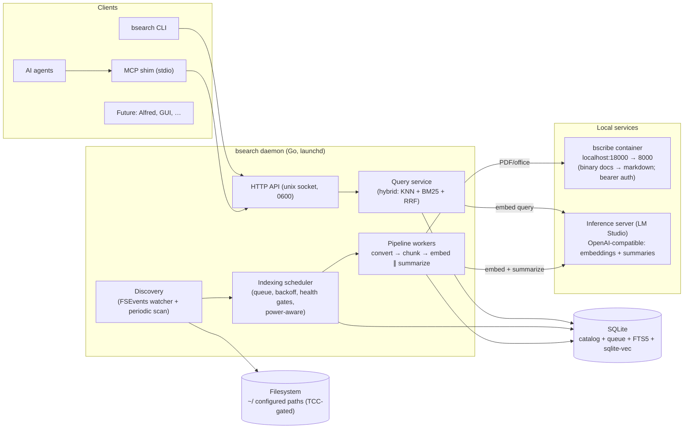

# bsearch — Design

| | |
|---|---|
| Author | Ben Crisp (ben@thecrisp.io) |
| Status | Draft |
| Created | 2026-07-19 |
| Updated | 2026-07-19 (adversarial review folded — see Closed issues; "crawler" renamed to "discovery") |

## Objective

bsearch indexes the files on your Mac — documents, PDFs, emails, images — and
lets you and your AI tools search them semantically, entirely locally.

## Background

Two motivations, honestly ranked: this is a fun project first, and a practical
one second.

The practical need: AI agents (Claude Code and similar) work dramatically
better with relevant context, but that context is scattered across the
filesystem in different formats — markdown notes, PDFs, office documents,
emails, images. There is no good local way to say "find me the documents
relevant to X" and hand results to an agent. Spotlight is keyword/metadata
search only — no semantic retrieval.

Prior art, own: `lore`, a semantic search engine for my Obsidian wiki,
vibe-coded quickly and now hard to maintain — I've lost the mental model of how
it fits together. It also has a design flaw worth fixing: it indexes
new/modified files at query time, adding user-visible lag, with no background
indexing. bsearch starts fresh rather than extending lore, with lessons carried
over: index ahead of time in the background; keep the design documented (this
doc) so the mental model survives.

## Goals

- **Give AI agents cheap access to local context.** An agent should be able to
  find the documents relevant to a task and pull them into context with minimal
  context-window spend — summaries first, full content on demand.
- **Find anything by meaning.** Any supported document on the machine is
  findable by describing what it's about, not by remembering filenames or
  keywords. Search must feel snappy — indexing happens in the background and is
  allowed to be slow; query speed is what the user experiences. Retrieval
  quality beats pure-vector: semantic and keyword signals combine (hybrid
  search).
- **Nothing leaves machines I control.** Content, embeddings, queries, and
  metadata stay on-device by default; at most they reach inference endpoints I
  choose (a private-tailnet inference box is legitimate — see Security §3).
  Privacy and data sovereignty are goals in their own right, not side effects
  of the architecture.
- **Stay understandable for years.** The design must survive long gaps between
  hacking sessions. Boring choices, documented decisions, clear boundaries —
  explicitly the anti-`lore` goal.

## Non-goals

- **No multi-user support.** Single user, single machine. There is no concept
  of accounts, tenants, or sharing.
- **No bundled inference.** bsearch never runs models itself — you bring an
  inference server (Ollama, LM Studio, vLLM, …) speaking a standard protocol.
  Keeps bsearch small and lets the model stack evolve independently.
- **No remote access by default.** The API listens locally only. Exposing it
  (e.g. over Tailscale) is a deliberate user action, not a supported default.
- **No commercial ambitions.** Personal tool, open source. No hosted version,
  no telemetry, no growth features.
- **Not cross-platform in v1.** Designed for Apple Silicon macOS. Nothing
  should gratuitously block Linux later, but no effort is spent on it.
- **No cloud sync or backup of the index.** The index is derived data; it can
  always be rebuilt from local files (with one caveat: doc_id continuity —
  see Data retention).
- **No cloud sources.** Gmail, Drive, Notion, web pages — out of scope.
  bsearch indexes the local filesystem only (Apple Mail counts: its store is
  local files).

## Missing features (deferred, wanted eventually)

- **Native macOS frontend.** A Swift menu-bar/settings app for monitoring
  indexing progress and editing config. Consequence: v1 is configured by file
  and observed via CLI (`bsearch status`).
- **Image indexing.** Text search over images via a vision model (captioning +
  embedding). Consequence: v1 indexes text-bearing documents only; the
  ingestion pipeline must still be designed so a new media type slots in as
  another converter, not a rework.
- **Email (Apple Mail).** Parsing the local Mail store. Consequence: v1 leaves
  a major personal corpus unsearchable; the discovery design must not assume
  "documents are files a user saved" (mail messages are many small files in a
  library directory — and one that requires Full Disk Access, see the TCC
  constraint).
- **Third-party integrations** (Alfred, Raycast, etc.). Consequence: none for
  v1 — the local API is the integration surface; anyone can build these later.

## Scenarios

### 1. Agent pulls context (primary)

Ben asks Claude Code to review his mortgage options. The agent calls bsearch
over MCP: `search("mortgage renewal terms and rates")`. bsearch returns ten
ranked hits, each with file path, score, and a short summary. The agent scans
the summaries — costing a few hundred tokens, not tens of thousands — decides
two documents matter, and fetches their full markdown with `get`. Total: two
round trips, context window spent almost entirely on the two documents that
matter.

### 2. Interactive search from the terminal

Ben half-remembers a PDF about heat-pump installation quotes from last year.
`bsearch search "heat pump quote"` returns ranked hits with paths and summaries
in well under a second. He opens the right file directly. No remembering
filenames, no Spotlight keyword roulette.

### 3. Background ingest

Ben exports a 40-page PDF report into `~/Documents`. He does nothing else.
Within a few minutes the bsearch daemon notices the new file, converts it to
markdown, chunks it, summarises it, embeds it, and stores the result. The first
search that mentions the report's topic finds it. Ben never ran an "index"
command and never felt the indexing cost. (Prerequisite: the daemon has been
granted Full Disk Access — see the TCC constraint below.)

## Constraints

- **Hardware:** MacBook Pro, Apple M5 Max, 128 GB unified memory. Ample for
  local models, but bsearch shares it with everything else — the index and
  daemon must be lightweight when idle.
- **Portable, often on battery.** Indexing is background work on a laptop, not
  a server job. Continuous CPU/GPU churn is unacceptable on battery. Design
  consequences: batched indexing intervals rather than constant activity,
  modest model sizes, and configurable power-aware behaviour (e.g. defer heavy
  indexing until on AC power, or throttle batch sizes on battery).
- **macOS TCC gates most of the corpus.** On macOS 10.15+, `~/Documents`,
  `~/Desktop`, `~/Downloads`, iCloud Drive, removable/network volumes, and
  most of `~/Library` (including `~/Library/Mail`) are consent-gated. A
  background launchd daemon gets **no consent dialog — just silent EPERM**;
  `~/Library` paths never prompt at all and need a manually-granted,
  non-scriptable **Full Disk Access** entry in System Settings. Design
  consequences: the daemon requires an FDA grant, documented in onboarding;
  discovery treats permission errors as first-class state, surfaced in
  `bsearch status` ("no access to ~/Documents — grant Full Disk Access"),
  never a silent skip. One-shot CLI use (M1) inherits the terminal's grants
  and is unaffected.
- **BYO inference server.** LM Studio today; must not be a hard dependency.
  bsearch speaks a standard protocol (OpenAI-compatible API) so any server
  works.
- **Summary model loaded only when needed.** The summarizer should not sit in
  memory between indexing runs — prefer servers that JIT-load and auto-unload
  after idle (LM Studio TTL; Ollama `keep_alive`); bsearch tolerates
  cold-start latency on the first request of a batch. The **embedding model is
  the deliberate exception**: it is small (hundreds of MB) and must serve
  interactive queries, so it stays resident — that residency is what makes the
  warm-search SLO honest.
- **macOS-first.** Filesystem watching, power detection, and launchd
  integration may use macOS-specific APIs behind ports; nothing should
  gratuitously block a Linux port later.

## SLOs

| Metric | Target | Consequence |
|---|---|---|
| Search latency (warm) | p95 < 500 ms | vector index in-process/local; embedding model resident (see Constraints) |
| Search latency (cold daemon) | < 3 s | acceptable to lazily open index |
| Index freshness (on AC) | new/changed file searchable ≤ 5 min, ~15 s typical while watching | FSEvents debounce window, not per-write. The ≤ 5 min bound is the scan-only cadence and is what the walk alone has to meet. A change the watcher was never told about waits for the walk, which is deliberately slower (15 min) while watching — the two together, not either alone, are the freshness story ([ADR 0013](docs/adr/0013-fsevents-watcher-and-event-driven-reconcile.md)) |
| Index freshness (battery) | ≤ 60 min or deferred, configurable | battery constraint |
| Corpus scale | ~100k docs, ~1M chunks | single-node embedded storage sufficient; no server DB. A PDF/email-heavy corpus may exceed 1M chunks — quantization is the planned configuration at that scale (see Vector search) |
| Availability | daemon auto-restarts (launchd); no nines target | it's a laptop |

These numbers are deliberately small and are the justification for the boring
architecture below. If they ever grow by an order of magnitude, revisit the
storage and vector-search rows first.

## Architecture & technology choices

| Concern | Choice | Why | Swap cost |
|---|---|---|---|
| Language | Go | Self-contained single-file binary (cgo links only system libraries — no third-party dylibs; fully static isn't possible on macOS); strong daemon/concurrency story; near-zero background CPU when idle and small RSS (avoids memory-pressure churn); a language I know | Rewrite — mitigated by hexagonal boundaries |
| Structure | Hexagonal (ports & adapters), ports as Go interfaces | Maintainability goal; makes the swap costs in this table real | n/a — this IS the swap mechanism |
| Process model | One `bsearch` binary: daemon (`bsearch serve`, run as launchd LaunchAgent) + CLI subcommands as clients | launchd gives native supervision, start-at-login, restart | Low |
| Storage | SQLite, one database file: catalog + queue + summaries in plain tables, FTS5 for keyword, sqlite-vec for vectors. **Derived data (chunks, vectors, summaries) is keyed by content hash, not by document** ([ADR 0015](docs/adr/0015-content-addressed-chunks-and-summaries.md)). Production pragmas from day one (WAL, `synchronous=NORMAL`, `busy_timeout=5000`, `foreign_keys=ON`, `temp_store=MEMORY`, tuned `mmap_size`/`cache_size`); writers use `BEGIN IMMEDIATE`; indexing writes in small batches so no write transaction outlives the busy timeout. Schema carries a version; migrations preferred, drop-and-reindex is the fallback of last resort (its true cost is battery-gated local inference over the whole corpus — potentially days) | One file, one engine, transactional consistency across catalog/queue/vectors/FTS; single-writer model fits (indexer writes, queries read; WAL keeps readers unblocked) | Storage behind ports; index is derived data (except doc_id continuity — see Data retention) |
| SQLite driver | cgo-based driver (mattn/go-sqlite3-class) with sqlite-vec statically compiled in via its Go bindings | Pure-Go drivers can't load C extensions; static linking keeps self-contained distribution, no runtime extension loading | Locked to native builds (cross-compiling cgo is painful — a future Linux port builds on Linux CI). Escape hatch: ncruces/go-sqlite3 (wasm) — sqlite-vec ships officially documented bindings for it (`asg017/sqlite-vec-go-bindings/ncruces`); that pure-Go route would also ease cross-compilation |
| Vector search | sqlite-vec `vec0`. Float32 brute-force KNN up to a few hundred thousand chunks; **binary quantization + rescore is the planned configuration at full corpus scale (~1M chunks)**, not an emergency lever. No ANN | Exact (or near-exact with rescore), zero index maintenance, delete-friendly. Scan cost is ~linear in vectors × dims: published 100k×768 runs well under 100 ms warm, but extrapolating the same numbers puts 1M×768 ≈ ~700 ms — over the SLO; the author's own ceiling for float vectors is "the hundreds of thousands". Quantized scan (32× smaller, XOR+popcount distance) + full-precision rescore of top-k×8 retains ~95% recall at ~1.03× total storage. ANN (DiskANN/IVF) immature in sqlite-vec and unneeded at this scale | Further levers: raise mmap/cache (make scan RAM-bound), partition keys. **Acknowledged bet:** sqlite-vec is pre-1.0 (no stable on-disk format guarantee) — version pinned; a format break is covered by drop-and-reindex |
| Keyword search | FTS5 + BM25 over chunks, fused with chunk-level KNN via RRF (k=60 default; semantic/keyword weights configurable). Results collapse to best-chunk-per-**content** ([ADR 0015](docs/adr/0015-content-addressed-chunks-and-summaries.md)) | Hybrid beats pure vector on exact terms (invoice numbers, names); same engine, same database file, one consistency/backup story. Pattern implemented in lore (chunk breadcrumbs + RRF) though never measured there — M2 measures it here | Same DB, additive |
| Doc conversion | bscribe over HTTP behind `ConverterPort`; plain text/markdown handled in-process. Adapter sends bscribe's required bearer token (from config); v1 uses the sync `POST /v1/convert` endpoint and reads the JSON envelope's `content` field. bscribe's native port is 8000 — `localhost:18000` is this machine's host mapping | No parser deps in the binary; LibreOffice/OCR churn isolated in a hardened container (non-root baked into the image; read-only rootfs, capability drop, and memory cap are operator run-flags — required flags recorded in deployment docs); bscribe already runs here and anticipated bsearch as a consumer | Adapter swap (lit CLI subprocess, docling) without touching domain; async job API available if large-doc sync timeouts warrant it |
| Change detection | FSEvents watch (macOS API behind `WatcherPort`, via `fsnotify/fsevents`) for near-real-time creates, edits, **and deletes**, plus periodic full scan for missed events; change = cheap size/mtime check, content hash to confirm. Events are debounced ~10 s and reconciled path-by-path against the same change detection the walk uses; an event stream that overflows or reports a volume appearing/disappearing escalates to a full walk rather than trusting a partial path list. The walk's cadence follows the watcher — 5 min scan-only, 15 min while watching ([ADR 0013](docs/adr/0013-fsevents-watcher-and-event-driven-reconcile.md)) | Freshness SLO without constant scanning; battery-friendly | Linux port = new watcher adapter (inotify) |
| Chunking | Markdown-aware, hand-rolled in Go (see below) | Everything is markdown post-conversion; tractable, dependency-free algorithm | Isolated pure function, versioned |
| Summaries | Pyramid summaries per document: 4 / 16 / 64 words + full text, generated at index time by the summary LLM. Word counts are targets, not contracts (validated and trimmed post-hoc). Documents exceeding the summarizer's context are handled map-reduce style: section/chunk summaries reduced to document summaries; the summarizer's minimum context requirement is part of the versioned stage | Agent context economy — survey cheap, zoom on demand (StrongDM pyramid-summaries technique, which pairs the ladder with MapReduce for over-context inputs) | Additive; regenerable without touching vectors |
| Embeddings / LLM | OpenAI-compatible HTTP (`EmbedderPort`, `SummarizerPort`); model names + endpoints in config. **Per-model query/passage prefix templates** (E5 `query:`/`passage:`, Nomic `search_query:`/`search_document:`, BGE/Qwen3 query instructions) stored in versioned pipeline metadata and applied identically at index and query time — asymmetric embedders lose substantial recall without matched prefixes (lore solves this per model family; lesson carried alongside the breadcrumb one) | BYO inference; LM Studio today | Config change; embedding model swap requires full re-embed (see pipeline metadata for the migration path) |
| API | HTTP+JSON over unix domain socket at `~/Library/Application Support/bsearch/bsearch.sock`, mode 0600 (comfortably under the ~104-char `sun_path` limit); listener abstraction so a TCP listener (with auth) can be added later | OS-enforced same-user access, no open ports, zero auth machinery in v1 | TCP = new listener + auth story; designed-for, not bolted-on |
| MCP | MCP server as a thin stdio shim over the same domain services | First-class agent access — the primary scenario | Thin layer over the API |
| Config | Single TOML file, `~/.config/bsearch/config.toml` (sample in Interfaces). Hand-edited config lives in `~/.config` (CLI convention); machine data lives in `~/Library/Application Support` (macOS convention) — deliberate split | Human-edited, no UI in v1; boring | Trivial |

### Indexing pipeline and queue

Pipeline per document: **discover → convert → chunk → (embed ∥ summarize) →
store.** Embedding and summarization are parallel branches after chunking: a
document becomes searchable as soon as it is embedded; summaries are
fill-later fields that enrich results when ready. A summarizer outage degrades
summary richness, never searchability.

**`∥` describes the dataflow graph, not concurrency.** It says the two branches
both derive from chunks and that neither blocks the other — embedding does not
wait for a summary, and a missing summary never gates searchability. It does
**not** license running them on separate goroutines, and by default they do
not: both run on the single indexing worker, in whatever order it chooses.
Two concurrent local-inference calls are in any case the wrong shape for a
battery-powered laptop (see the power-aware gate below), and a second goroutine
would break the single-writer invariant stated next.

#### Single-writer invariant

**Exactly one goroutine writes the catalog** ([ADR
0014](docs/adr/0014-single-writer-catalog.md)). This is a hard invariant, not a
current implementation detail, and it governs every stage added later.

It exists because both bugs the two-writer design produced were the same
defect: a read-modify-write whose read and write sat in different transactions,
with a second writer in between. [#62](https://github.com/bcrisp4/bsearch/issues/62)
minted two ids for one path; [#63](https://github.com/bcrisp4/bsearch/issues/63)
left a document `indexed` with no chunks — terminal, so nothing re-queued it,
permanently unsearchable with nothing to signal it. Neither was found by a
test; both were pre-registered in ADR 0013's own Consequences section and
shipped anyway.

The rules that follow from it:

- **New pipeline stages run on the indexing worker.** Summarization included.
  If a stage needs genuine concurrency, the concurrent part is the network or
  CPU work — the *write* is handed back to the one goroutine that owns it.
- **Reads are unrestricted.** WAL keeps readers unblocked; search, `status`
  and the HTTP API read freely from any goroutine. The invariant is about
  writes only.
- **A stage that only records metadata uses a narrow setter**, never
  `UpsertDocument`, which replaces a document's chunks wholesale and deletes
  their vectors. Recording "my stage ran at version X" through a method that
  also rewrites derived data is how #63's signature is reproduced without any
  concurrency at all.
- **Do not defend the invariant with in-row guards.** A compare-and-set on
  `state` cannot see a writer that rewrites the row while leaving its state
  alone, which is exactly what `UpsertDocument` does — the reason
  [#69](https://github.com/bcrisp4/bsearch/issues/69) was closed unbuilt. The
  invariant is held structurally, by there being one writer, or not at all.
- **Changing this requires a superseding ADR**, and an answer to what replaces
  the structural guarantee.

Across processes the same property is enforced by the single-instance flock in
`socket.Listen`: one daemon, one indexing worker, one writer.

#### Derived data is keyed by content

Chunks, vectors and summaries are functions of a file's **content**, so they are
keyed on the content hash, not on `doc_id` ([ADR
0015](docs/adr/0015-content-addressed-chunks-and-summaries.md)). `documents`,
`doc_id`, the queue and the API contract are unaffected.

```sql
documents  (id, path, content_hash, state, attempts, …)
chunks     (id INTEGER PRIMARY KEY AUTOINCREMENT, content_hash NOT NULL,
            ordinal, text, heading_path, byte_start, byte_end,
            UNIQUE (content_hash, ordinal))
summaries  (content_hash, level, text, PRIMARY KEY (content_hash, level))
vec_chunks (rowid = chunks.id)
```

What follows from it:

- **A rename preserves everything derived.** `documents.path` updates; the hash
  is unchanged, so chunks, vectors and summaries stay valid with no re-embed.
- **Duplicate content is embedded once** and shares summaries — copies,
  boilerplate, the same PDF filed in two folders.
- **`chunks.id AUTOINCREMENT` is load-bearing** and survives unchanged.
  `vec_chunks` keys on it, the FTS5 external-content table keys on it
  (`content='chunks', content_rowid='id'`), and it is the schema's only
  immutable version token — the liveness check that refuses to write a vector
  against a freed chunk id depends on ids never being reused.
- **The pipeline hashes the bytes it read**, rather than trusting the hash
  discovery recorded earlier, and writes chunks under that hash. Free (sha256
  over bytes already in memory) and strictly more correct: the chunks are
  provably of the content they are filed under.
- **Orphan chunks need a sweep**, because `ON DELETE CASCADE` from `documents`
  no longer reaches them — other files may share them. `DELETE FROM chunks
  WHERE content_hash NOT IN (SELECT content_hash FROM documents)`, on the
  indexing worker, after deletions. It must be **one statement**: a
  find-then-delete whose target is restored to prior content in the gap (editor
  undo, `git checkout`) deletes chunks whose hash is referenced again.
- **Search inner-joins chunks to documents**, so a content hash no path
  references contributes nothing to results. Orphans are invisible from the
  moment their last path goes, whenever the sweep happens to run.

#### Queue

The queue is a SQLite-backed state machine — no external queue infrastructure.

- **Catalog row per file:** `path, content_hash, size, mtime, state,
  stage_versions, attempts, next_retry_at, last_error`. States: `discovered →
  converted → chunked → embedded → indexed`, plus `failed` (permanent) and
  `deleted`. Summarization is tracked as a separate per-document field, not a
  pipeline gate.
- **Enqueue:** FSEvents callbacks and the periodic scan both upsert
  "needs work" rows — idempotent, so rapid saves coalesce naturally. A
  debounce window (10 s, fixed and armed by the first event of a burst — a
  window that reset on activity would never close on a file being written
  continuously) avoids grabbing files mid-write; closing early is harmless,
  since the content hash makes the work idempotent and the rest of the write
  opens another window. Permission errors (TCC) are recorded per path and
  surfaced in `status`, never silently skipped. Dataless iCloud files
  (Optimize Storage placeholders) are skipped, not materialized — indexing
  must never trigger cloud downloads.
- **Dispatch:** a scheduler loop wakes on timer/notify and reads a batch
  (`SELECT … WHERE state NOT IN ('indexed', 'failed', 'deleted') AND
  next_retry_at <= now LIMIT n`), served by a partial index that excludes
  terminal rows so claim cost tracks the backlog rather than the corpus.
  Terminal states never re-enter dispatch; purging `deleted` rows is a
  separate path. **One indexing worker** (the single-writer invariant above),
  so there is no claim at all — not a claimed state, and not the in-memory
  claim set this section originally anticipated: nothing is reserved, so
  nothing has to be released. A crash mid-batch redoes in-flight items on
  restart, which is safe because every stage is an idempotent upsert (ADR
  0011). The worker re-reads each document by id immediately before working on
  it: a batch is read once and worked through over the following minutes, so a
  claimed copy can name a path the file no longer has (ADR 0014).
- **Overrun policy — Prefer Old.** The interval timer is reset after a cycle
  finishes rather than on an absolute schedule, so a trigger arriving during a
  cycle is shed, not queued and not pre-empting. A cycle that runs long is
  working, not hung, and a second concurrent drain would contend for the same
  rows and the same inference server. Nothing is lost: the queue is durable
  and the next cycle re-reads it.
- **Stated limits (ADR 0011, ADR 0013).** Batch 32 documents; 5 attempts;
  backoff base 30 s, cap 15 min; scan every 5 min scan-only or 15 min while
  watching, independent of the drain interval. Watcher: 1 s FSEvents
  coalescing latency, 10 s debounce window, and a held-back batch collapses
  to a full-walk request past 8192 paths. Queue **depth is deliberately
  unbounded** — the queue is the catalog, one row per file, bounded by the
  corpus, with no submission path that can inflate it.
- **Staleness is swept, not waited for.** Dispatch skips terminal states, so a
  corpus fully indexed under a superseded model looks like no work at all.
  Once per process the scheduler moves documents whose `stage_versions`
  predate current configuration back to `discovered` — which is what makes a
  model or chunker change re-embed the corpus with no command run.
- **Transactions never wrap network calls.** Convert/embed/summarize happen
  first; then a short batched write. An open write transaction must never wait
  on bscribe or an inference server (busy-timeout discipline).
- **Batching where it pays:** embedding calls batch many chunks per HTTP
  request; DB writes batch per transaction and stay short.
- **Health gates for every external service.** Before draining a batch that
  needs an external service, the scheduler probes it (bscribe `/healthz`;
  inference endpoints likewise). Down → skip that batch, log once, retry next
  cycle. Outage time burns no per-file attempts — this applies equally to
  converter, embedder, and summarizer, so a transient outage can never mark
  healthy documents `failed`.
- **Retry:** transient failures with the service healthy → exponential backoff
  via `next_retry_at`, using **full jitter** so a batch that fails together
  does not return together; attempts capped, then `failed` with reason.
  "With the service healthy" is enforced by re-probing after a transient
  failure: a failed re-probe means the service went down mid-batch, so the
  batch is deferred and no attempt is charged. Permanent failures (unparseable
  document) → `failed` immediately. A file change resets `failed`.
- **Power-aware gate:** the scheduler consults power state before dispatching
  heavy stages (convert/summarize/embed); on battery it lengthens intervals,
  shrinks batches, or defers entirely, per config. Cheap stages (catalog scan)
  always run.
- **Crash-safe:** all durable state is in SQLite; a daemon restart resumes
  where it left off.
- **Priority:** newly-changed files index before backlog (recency ordering,
  with aging so the initial bulk backlog and due retries can't be starved
  indefinitely).
- **Observable:** `bsearch status` shows per-state counts, failure reasons,
  last-scan and last-progress timestamps, and the current gate reason
  ("deferred: on battery", "embedder unreachable", "no access to ~/Documents")
  — a stalled queue is always distinguishable from a deferred one.

### Converter degradation (bscribe down)

- Conversion is one pipeline stage; bscribe unreachable → binary-format items
  stay pending and retry with backoff (attempts not burned — health gate
  above). Nothing is lost — the queue is durable.
- Partial degradation, not outage: text/markdown items skip conversion and
  keep flowing. Search never touches bscribe.
- Response classification: connection refused / 5xx / timeout → transient,
  retryable. **422** (supported format, unparseable content) → permanent
  `failed`. **415** (unsupported format) and **413** (too large) → permanent
  `failed` with distinct reasons. Never retried until the file changes.
  Prevents poison-file retry loops.
- Visible in `bsearch status`: "1,204 indexed · 37 pending (converter
  unreachable) · 2 failed".

### Chunking

Post-conversion everything is markdown, so chunking is markdown-structural:

- Parse to a heading tree (H1–H6); the base unit is section content under a
  heading.
- Target ~256–512 tokens per chunk; merge tiny neighbours (min ~64); split
  long sections at paragraph boundaries with ~10–15% overlap (max ~1024).
  Token counts are heuristic (≈ chars/4) — there is no tokenizer in-process
  ("no models in-process, ever"), so budgets are approximate and
  model-relative; the min/max bounds carry the slack.
- **Hard ceiling: the embedding model's input limit** (recorded in pipeline
  metadata — distinct from the *dimension* cap; both happen to be measured in
  units of ~1024 but are different limits). An atomic chunk that exceeds it is
  split as a fallback and flagged in `status` — never silently truncated.
- **Breadcrumb prefix:** each chunk is embedded with its heading path
  prepended ("Mortgage Renewal 2026 > Offers > Broker A") — contextualizes the
  chunk for the embedding model. Cheap, implemented in lore (unmeasured there;
  M2's harness can A/B it here).
- Tables and code blocks are atomic — never split mid-table (subject to the
  hard ceiling above).
- **Encoding:** in-process text ingestion detects BOM/UTF-16/UTF-8 and
  transcodes; undecodable files are marked `failed` with reason, never
  ingested garbled.
- Stored per chunk: heading path, byte offsets into the source markdown,
  position ordinal. Offsets let `get` return chunk-in-context.

### Pipeline metadata and model migration

Recorded per document/chunk: content hash, converter version (bscribe),
chunker version, embedding model + dimensions + **prefix templates** + input
ceiling, summarizer model + context requirement. The database schema itself is
versioned.

`stage_versions` stays **per document** even though the derived data it
describes is per content ([ADR
0015](docs/adr/0015-content-addressed-chunks-and-summaries.md)). That is what
makes deduplication fall out of the existing queue instead of needing new
machinery: a second file with identical content is discovered and claimed as
usual, the pipeline hashes it, finds chunks already at current stage versions,
skips the embed and records its own versions. One embed, two indexed documents.
A chunker or model bump resets both rows, and whichever is claimed first does
the single re-chunk that the other then reuses.

A search can only use one embedding model — a query embedded with model A is
meaningless against model B's vectors — so swapping embedding models always
means re-embedding everything. The metadata buys:

- **Staged migration:** the old vector table keeps serving while a new-model
  table fills in the background; atomic cutover when complete. No search
  downtime, no big-bang rebuild. (Different dimensions force a separate `vec0`
  table anyway — blue/green falls out naturally.) Note: migration transiently
  doubles vector storage. *Implementation status: the daemon cuts over
  immediately on model change — its stale sweep re-queues the corpus and
  search serves the new, initially empty generation while re-embedding fills
  it (ADR 0011). Self-healing, but with a search-quality dip for the duration;
  the staged fill + deferred cutover that removes the dip lands with
  `bsearch reindex` (issue #24).*
- **Partial rebuilds:** chunker change → re-chunk + re-embed only affected
  docs; summarizer change → regenerate summaries only, vectors untouched.
- **Auditability:** `bsearch status` reports exactly what's stale against
  current config. *Implementation status: status reports how many documents
  the stale sweep re-queued this process, and the backlog they became; the
  pre-sweep "what would be stale" audit has no reader now that the sweep is
  automatic (ADR 0011) — it becomes useful again with `bsearch reindex`
  (issue #24), which needs to say what it is about to do.*

**Disk budget:** vectors are the dominant term — ~4 GB float32 at the 1M ×
1024-dim cap (quantized index adds ~3%; FTS + stored markdown on top).
Footprint is reported in `bsearch status`.

## System diagram


```mermaid
flowchart LR
    subgraph clients["Clients"]
        CLI["bsearch CLI"]
        MCP["MCP shim (stdio)"]
        AGT["AI agents"]
        ALF["Future: Alfred, GUI, …"]
    end

    subgraph daemon["bsearch daemon (Go, launchd)"]
        API["HTTP API (unix socket, 0600)"]
        QRY["Query service<br/>(hybrid: KNN + BM25 + RRF)"]
        SCHED["Indexing scheduler<br/>(queue, backoff, health gates,<br/>power-aware)"]
        DISC["Discovery<br/>(FSEvents watcher + periodic scan)"]
        PIPE["Pipeline workers<br/>convert → chunk → embed ∥ summarize"]
    end

    subgraph external["Local services"]
        BSC["bscribe container<br/>localhost:18000 → 8000<br/>(binary docs → markdown; bearer auth)"]
        INF["Inference server (LM Studio)<br/>OpenAI-compatible: embeddings + summaries"]
    end

    DB[("SQLite<br/>catalog + queue + FTS5 + sqlite-vec")]
    FS[("Filesystem<br/>~/ configured paths (TCC-gated)")]

    AGT --> MCP
    CLI & MCP --> API
    API --> QRY
    QRY --> DB
    QRY -->|"embed query"| INF
    DISC --> FS
    DISC --> SCHED
    SCHED --> DB
    SCHED --> PIPE
    PIPE -->|"PDF/office"| BSC
    PIPE -->|"embed + summarize"| INF
    PIPE --> DB
```

## Interfaces

### CLI

```
bsearch serve                     # run daemon (launchd invokes this); indexes in the background
bsearch search "heat pump quote" [--limit 10] [--level 4|16|64] [--mode hybrid|semantic|keyword] [--json]
bsearch list [path-prefix] [--sort modified|path] [--level 4|16|64] [--limit 100]
bsearch get <doc-id> [--level 4|16|64|full]
bsearch status                    # index counts, queue depth, gate reasons, permission failures, disk footprint
bsearch reindex [path]            # force re-index of path or everything
```

Every subcommand except `serve` is a client of the daemon's socket, with no
direct-database fallback — one query path, so there is one place that agrees
about prefix templates and index identity
([ADR 0010](docs/adr/0010-cli-as-socket-only-client.md)). There is no
indexing command: the daemon owns discovery and the queue and is the only
writer ([ADR 0012](docs/adr/0012-daemon-owns-the-index-writer.md)), creating
and migrating the database itself. `reindex` is how a rebuild is forced —
needed less often than expected, since a configuration change is swept and
re-embedded automatically. (`bsearch eval` is not a client either, but it
writes only its own per-corpus database, never the index.)

### HTTP API (unix socket, JSON)

Socket: `~/Library/Application Support/bsearch/bsearch.sock` (0600).

**`POST /v1/search`**

```json
{"query": "heat pump installation quote", "limit": 10, "mode": "hybrid", "summary_level": 16}
```

`mode`: `hybrid` (default) | `semantic` | `keyword`. `summary_level`:
`4 | 16 | 64`, default `16` — drop to 4 for wide surveys, raise to 64 for
fewer, richer hits. Optional `min_score`: no default floor — distance scores
are model-dependent and uncalibrated, so callers (especially agents) should
judge relevance from summaries, not scores.

Retrieval granularity: KNN and FTS both run at **chunk level**; RRF fuses the
chunk rankings; results collapse to the best chunk per **content**
([ADR 0015](docs/adr/0015-content-addressed-chunks-and-summaries.md)).
`chunk_preview` and `heading_path` come from the winning chunk.

One content can live at several paths (duplicate files), so a hit names one
primary path and lists the rest in `also_at` — omitted when empty, which is the
overwhelmingly common case. Returning one hit per path instead would undo
deduplication exactly where it pays: the scores are identical, so N copies
would consume N slots of `limit` with no ranking signal to order them, and an
agent would pay N× the tokens for 1× the information.

Response:

```json
{
  "hits": [
    {
      "doc_id": "d_8f3a91",
      "path": "~/Documents/quotes/heatpump-vaillant-2025.pdf",
      "score": 0.83,
      "summary": "Vaillant aroTHERM quote from March 2025: supply and install, 7kW, £11,400 including cylinder.",
      "chunk_preview": "…total supply and installation cost of £11,400 inc. VAT…",
      "heading_path": "Quote > Cost breakdown",
      "modified": "2025-03-14T10:22:00Z",
      "also_at": [
        {"doc_id": "d_1c04b2", "path": "~/Archive/2025/heatpump-vaillant-2025.pdf"}
      ]
    }
  ],
  "took_ms": 87
}
```

- `also_at` — the other paths holding this same content, absent when there are
  none. `path` and `doc_id` name the **primary**: the referencing document with
  the most recent `mtime`, tie-broken by path ascending so the same corpus
  always yields the same answer. When a query is scoped to a path prefix, both
  the primary and `also_at` are drawn only from documents inside that scope —
  a scoped search never returns a path outside its own scope.
- `score` — fused (RRF) relevance, higher = better. *Implementation status:
  the M1 CLI's `--json` output predates fusion and instead emits `distance`
  (raw KNN distance, lower = better, uncalibrated); `score` is deliberately
  reserved until RRF lands (M4) so the name never carries two meanings.*
- `summary` — whole-document pyramid summary at the requested level (may be
  absent if not yet generated — summaries are fill-later, never a gate).
- `chunk_preview` — ~150-char excerpt of the best-matching chunk: why this hit
  matched (match evidence), complementing the summary (what the doc is about).
- `doc_id` — opaque surrogate ID minted at first discovery. Stable across
  content edits (path unchanged) and across renames/moves: a rename is
  detected when a file's content hash matches an existing catalog row **whose
  path no longer exists on disk**. A hash match whose old path still exists is
  a copy, not a rename → new id (no false merge of duplicate content — empty
  files, boilerplate, `cp`). Multiple candidate rows disqualify rename
  detection → new id. Known limitation: rename + edit within one scan window
  looks like delete + create and mints a new id — which since [ADR
  0015](docs/adr/0015-content-addressed-chunks-and-summaries.md) costs only a
  stale agent reference, not lost derived data: chunks, vectors and summaries
  key on the content hash, so they survive whatever the id does. A full
  drop-and-reindex re-mints all ids (see Data retention).

**`GET /v1/docs`** — enumeration (the pyramid "survey the terrain" interface).

```
GET /v1/docs?prefix=~/Documents/tax&sort=modified&limit=100&summary_level=4
```

```json
{
  "docs": [
    {"doc_id": "d_8f3a91", "path": "~/Documents/tax/heatpump-vaillant-2025.pdf", "summary": "Heat pump installation quote", "modified": "2025-03-14T10:22:00Z"}
  ],
  "total": 342
}
```

`summary_level`: `4 | 16 | 64`, default `4` — enumeration is where the 4-word
level earns its place: results aren't query-ranked, so summaries carry all the
signal, and lists are long.

**`GET /v1/docs/{doc_id}?level=full|64|16|4`** — single document: full
markdown or pyramid level.

**`GET /v1/status`** — same payload as `bsearch status --json`. Always answers
`200`, including when there is no index or the daemon can't read it: an
endpoint that fails when things are broken withholds exactly what is being
asked for.

Two halves, from sources that fail independently: `index` is what the database
holds, `indexing` is what the background loop is doing — "nothing is indexed"
and "nothing is indexing" are different problems, and the second is readable
even when there is no database at all.

```json
{"version": "v0.2.0", "pid": 4312, "uptime_s": 90421,
 "socket": "~/Library/Application Support/bsearch/bsearch.sock",
 "db_path": "~/Library/Application Support/bsearch/bsearch.db",
 "index": {"ready": true, "model": "text-embedding-embeddinggemma-300m", "dims": 768,
           "documents": {"discovered": 35, "converted": 0, "chunked": 2,
                         "embedded": 0, "indexed": 1204, "failed": 2, "deleted": 0},
           "queue": {"pending": 37, "retrying": 2},
           "failures": [{"reason": "file is not valid UTF-8", "documents": 2,
                         "example_path": "~/Documents/notes/legacy.txt"}],
           "disk": {"db_bytes": 432013312, "wal_bytes": 4096, "total_bytes": 432017408}},
 "indexing": {"running": true, "gate": "idle — nothing to index", "deferring": false,
              "last_scan": "2026-07-25T11:58:00Z", "last_cycle": "2026-07-25T11:58:30Z",
              "last_progress": "2026-07-25T11:56:00Z",
              "scan_errors": 0, "scan_reached_nothing": false,
              "watch": {"running": true, "roots": 1,
                        "last_event": "2026-07-25T11:56:00Z",
                        "reconciled": 42, "deleted": 3, "rescans": 0},
              "totals": {"indexed": 1204, "failed": 2, "skipped": 0, "retried": 0, "swept": 0}}}
```

When `ready` is false a `reason` says why ("no index database at …",
"nothing embedded yet", a model/config disagreement); the document counts are
still reported, because a database full of discovered-but-unindexed rows is
when they matter most. `gate` is why the last indexing cycle did no work, in
the user's terms, and `last_progress` against `last_cycle` is what
distinguishes a slow queue from a stalled one. A scan that hit permission
errors adds `path_errors` (a capped sample of `{path, error}`);
`scan_reached_nothing` is the missing-Full-Disk-Access signature. When the
indexing loop could not be started at all, `indexing` is
`{"running": false, "reason": …}`.

`watch` is the near-real-time half of freshness, and it is reported separately
for the same reason `indexing` is: it fails on its own. `running: false`
carries a `reason` and means the periodic scan is carrying freshness alone —
a working mode, not a fault. A watcher that is running with no `last_event`
is the other shape worth recognising: subscribed, healthy, and being told
nothing, which on macOS means the daemon is missing Full Disk Access.

Every field is additive and omitted when absent, so `bsearch status --json`
copies the daemon's bytes through unparsed and a newer daemon's fields reach
consumers that understand them.

**Errors.** Every non-2xx response — including ones the HTTP router would
otherwise answer in plain text — carries `{"error": {"code": …, "message": …}}`.
`code` is a stable machine token; `message` is user-facing prose, rendered
verbatim by the CLI. The code table and the request-decoding rules are in
[ADR 0009](docs/adr/0009-unix-socket-http-api.md).

**Summary ladder: 4 / 16 / 64 words / full text.** Generated at index time;
stored, not computed per query.

### Sample config

```toml
# ~/.config/bsearch/config.toml

[paths]
include = ["~"]
# extends the built-in deny-list (secrets, ~/Library, caches, VCS/deps dirs)
exclude = ["~/Archive/old-junk"]

[inference]
endpoint        = "http://localhost:1234/v1"   # OpenAI-compatible (LM Studio)
embedding_model = "text-embedding-embeddinggemma-300m"  # default from the synthetic-corpus eval: google/embeddinggemma-300m as LM Studio serves it (768d, ceiling 2048); registry supplies its prefixes
summary_model   = ""                           # summariser bench deferred until pyramid summaries exist (#51)
# Optional per-field overrides of the built-in per-model prefix registry —
# for embedding models the registry doesn't know. {q}=query, {d}=passage,
# {t}=heading-path breadcrumb (title slot).
#query_template       = "query: {q}"
#passage_template     = "title: {t} | text: {d}"
#input_ceiling_tokens = 2048

[converter]
endpoint   = "http://localhost:18000"          # bscribe (host mapping of native 8000)
token_file = "~/.config/bsearch/bscribe-token"

[power]
ac.index_interval      = "5m"
battery.index_interval = "60m"                 # or "defer"
```

### MCP (stdio shim over unix socket)

Three tools mirroring the API:

- `search(query, limit?, mode?, summary_level?)`
- `list_documents(prefix?, sort?, limit?, summary_level?)`
- `get_document(doc_id, level?)`

Tool descriptions encode the intended drill-down: survey with
`list_documents`/`search` at coarse levels first; `get_document` full text
only for chosen hits — and note that scores are uncalibrated (judge relevance
from summaries).

## Security

Threat model: single-user machine, no network exposure by default. (macOS TCC
is treated as a constraint, not a threat — see Constraints; the security
property it provides is that *other* sandboxed apps can't read bsearch's data
dir, and the cost is that bsearch itself needs Full Disk Access.) Threats
considered:

**1. The index is a honeypot.** The SQLite database concentrates full text,
summaries, and embeddings of everything indexed — a stolen laptop or leaked
backup exposes it all in one file.

- Database lives under `~/Library/Application Support/bsearch/`, mode 0600.
- At-rest protection is FileVault full-disk encryption (assumed on). No
  application-level encryption: it would add key-management complexity without
  protecting against the realistic threat (same-user malware reads the source
  files anyway).
- The backup half of the threat is closed mechanically: the daemon marks its
  data dir excluded from Time Machine at startup (see Data retention).

**2. Same-user processes can reach the API.** The unix socket is 0600, so the
OS blocks other users — but any process running as Ben can query it. Accepted:
such a process can already read the source documents directly; bsearch adds
convenience, not new access. No auth on the socket in v1.

**3. Inference endpoint determines where content flows.** Every chunk and
summary passes through the configured embedding/summary endpoints. bsearch
does not police this — endpoint choice is the user's (a remote inference box
on a private tailnet is a legitimate setup). The privacy guarantee is
therefore conditional: content stays as local as the inference endpoints you
configure. Documented prominently in the config reference. (The bscribe
endpoint is the same class of sink; both are user-controlled local/tailnet
services.)

**4. Malicious documents.** Untrusted files (downloaded PDFs) hit parsers with
long CVE histories.

- Binary formats are parsed inside the bscribe container, isolated from the
  daemon. Non-root is baked into bscribe's image; read-only rootfs, capability
  drop, and the memory cap are **run-flags** — bsearch's deployment docs
  record the required flags, since the isolation claim depends on them. A
  parser exploit lands in a disposable container, not in the process holding
  the index.
- In-process parsing is markdown/plain text only, in memory-safe Go.

**5. Prompt injection via indexed content.** A malicious document can contain
text crafted to manipulate the LLM that summarizes it, or the agent that later
reads search results. Summaries are generated with a fixed instruction
template and treated strictly as data; but no mitigation fully prevents an
agent from reading attacker-authored text in results. Residual risk,
documented for consumers: treat bsearch results as untrusted content.

**6. Future TCP exposure.** Out of scope for v1, but the listener abstraction
requires an auth story (bearer tokens, as bscribe does) before any TCP
listener ships. Recorded so it isn't bolted on casually.

## Privacy

- **Sensitive data held:** converted document text, chunk embeddings
  (partially invertible — treat as content-equivalent), summaries, file paths,
  and index metadata. All local, all in the one database.
- **Excluded by default — secrets:** `~/.ssh`, `~/.gnupg`, keychains, `.env`,
  private key patterns, browser profiles.
- **Excluded by default — noise and volume:** `~/Library` (until Mail support
  deliberately carves in), caches, `node_modules`, `.git` and other VCS
  internals, package/bundle internals, and bsearch's own data directory. This
  is a battery/idle-CPU measure as much as a privacy one — a `$HOME` scan
  without it stat-churns millions of junk files every scan cycle.
- Config extends the deny-list; exclusions win over includes. Indexing scope
  is opt-in-by-path (`$HOME` default with the excludes above).
- **Queries are sensitive too.** Query text is never written to logs at
  default level (queries reveal what you're thinking about). Debug logging
  that includes queries/content is explicit opt-in and flagged as such in
  config.
- **Logs generally:** operational events only (files indexed, failures,
  timings). Never document content, never summaries, never query text at
  default level.
- **No telemetry of any kind.**

## Data retention

- **The index is derived data — with one caveat.** Source files are never
  modified or moved; everything in the database is regenerable from them
  except **doc_id continuity**: ids are opaque surrogates, so a full
  drop-and-reindex re-mints them and breaks references held by agents or
  integrations. Rare and accepted — schema migrations are preferred precisely
  so rebuilds stay exceptional.
- **Deletion follows source, near-real-time.** Deletes arrive via FSEvents
  like creates and edits → catalog row purged, for the path and everything
  beneath it (an event does not say whether the vanished path was a file or a
  directory). Chunks, vectors, summaries and FTS entries key on the content
  hash ([ADR
  0015](docs/adr/0015-content-addressed-chunks-and-summaries.md)), so they are
  removed by the orphan sweep rather than by cascade — another file may hold
  the same bytes, and deleting one copy must not blind the other. **Removal
  from results is immediate regardless**: search inner-joins chunks to
  documents, so content no path references contributes nothing from the moment
  the catalog row goes. The sweep reclaims space; it is not what makes a
  deletion take effect. At the index level the content is gone — no longer
  searchable or retrievable.
  Storage-layer honesty: SQLite leaves deleted bytes in freelist/WAL pages
  until checkpoint/vacuum; accepted residue, covered by FileVault, not worth
  `secure_delete` write-amplification. *Implementation status: the event path
  ships (ADR 0013), and it purges only on positive evidence — an `ENOENT` on
  a path an event named, whose parent is still there. The two cases that
  guard rules out — a file deleted while the daemon was not running, and a
  subtree that vanished without its own directory event — stay indexed until
  the scan-side reconcile lands
  ([#57](https://github.com/bcrisp4/bsearch/issues/57)). Being slow there is
  deliberate: a naive "the walk didn't visit it, so it's gone" turns an
  unmounted volume or a revoked TCC grant into a corpus wipe.*
- **No history.** Only the current version of a file is indexed; edits replace
  prior chunks/embeddings.
- **Backups:** the daemon sets a Time Machine exclusion on its data directory
  at startup (`tmutil`/`CSBackupd` API) — a mechanism, not a recommendation.
  The index is derived (minus id continuity, accepted); excluding it keeps a
  content-concentrating file out of backups (Security threat 1).

## Licensing

MIT. No commercial ambitions to protect, maximum simplicity, zero friction for
anyone who finds it useful. (Alternative considered: PolyForm Noncommercial —
rejected; no interest in policing use.)

## Milestones

Ordering philosophy: user-visible value first; scaffolding only when forced.
M1 replaces lore's core function — already useful on day one.

**M1 — Search my markdown.** One-shot `bsearch index` + `bsearch search` (no
daemon). *`bsearch index` was retired in M3 once the daemon took over the
writer role (ADR 0012).* Scans configured paths, text/markdown only; chunks, embeds via LM
Studio, stores in SQLite + sqlite-vec; semantic CLI search. Demo: semantic
search over the Obsidian vault from the terminal. (No TCC issues: one-shot CLI
inherits the terminal's grants.)

**M2 — Model bake-off.** Small eval harness over a personal golden set
(~30–50 real queries with known-correct documents, drawn from own corpus).
The harness is **prefix-aware** — per-model query/passage templates applied
correctly — or the bake-off measures the wrong thing for asymmetric models.
Compare candidate embedding models on retrieval quality (recall@10, MRR),
index cost (time, battery), and query latency; compare summarizer candidates
on summary quality at each pyramid level (spot-check) and tokens/sec. Output:
default embedding + summary models recorded in this doc (Closed issues), with
eval scripts kept in-repo for re-runs when new models appear. Demo: a table
justifying the defaults.

**M3 — Always fresh.** Daemon (`serve`), FSEvents + periodic scan, durable
queue with retry/backoff and health gates, unix-socket API, `status`. launchd
agent. **TCC onboarding:** daemon detects permission failures and surfaces
them in `status`; docs cover granting Full Disk Access. Demo: save a note,
search finds it a minute later, no manual indexing.

**M4 — Hybrid + pyramid.** FTS5 + RRF fusion; pyramid summaries (4/16/64)
generated at index time; `list`, `get`, level params. Demo: exact-term queries
work (invoice numbers, names); survey/drill-down flow via CLI.

**M5 — Agents.** MCP server (`search` / `list_documents` / `get_document`).
Demo: Claude Code answers a question from local documents it found itself —
the primary scenario, end to end.

**M6 — Beyond markdown.** bscribe integration: PDFs + office docs flow through
the pipeline; converter health in `status`; degradation handling. Demo: search
finds content inside a PDF quote (in a TCC-granted directory).

**M7 — Live like a good laptop citizen.** Power-aware scheduling (AC/battery
policies), tuned batch intervals, `reindex`, operational polish.

Deferred beyond v1: image indexing, Apple Mail, native macOS frontend (see
Missing features).

## Open issues

- **Default models.** Embedding default **decided** — EmbeddingGemma-300m
  (see Closed issues). **Summariser default still open:** its bench is
  deferred until the pyramid-summary machinery exists (#51), so no
  `summary_model` is recorded yet. Recorded constraints (still binding):
  OpenAI-compatible endpoints; embedding dimensions ≤ ~1024 (scan latency,
  storage) and input ceiling recorded per model; query/passage prefix
  templates per model; summarizer small enough for battery-tolerable index
  runs with context ≥ the map-reduce section size; embedding model small
  enough to stay resident.
- **Embedding context strategy for long documents.** Chunk-level embeddings
  decided; whether to also embed summaries (a doc-level vector for coarse
  retrieval) — decide during M4 when pyramid data exists.
- **FSEvents edge cases — mostly closed (ADR 0013).** Overflow, dropped
  events, volumes appearing/disappearing, and a watch root being replaced all
  resolve the same way: the batch collapses to a full-walk request rather
  than a partial path list. Directory moves are handled by descending an
  existing directory in the event set, so a renamed folder keeps its
  documents' ids. (iCloud dataless files were already resolved: skipped,
  never materialized.) **Still open:** packages/bundles are indexed as
  ordinary directories, so a `.app` or `.rtfd` under an include root is
  walked rather than treated as one item; whether that needs narrowing waits
  on a real corpus. Overflow escalates to a *full* walk rather than the
  subtree `MustScanSubDirs` names — precision deferred, since a walk is about
  a second warm.

## Closed issues

- **Language: Go over Python/TypeScript.** Python: best doc-processing
  ecosystem, but conversion moved to bscribe so that advantage evaporates;
  daemon deployment weaker. TypeScript: native liteparse, but weakest language
  and the liteparse path was superseded by bscribe. Go wins on daemon
  ergonomics, self-contained binary, low idle footprint.
- **Doc conversion: bscribe over lit CLI subprocess / docling in-process.**
  Subprocess = external Node dependency to manage, no memory isolation.
  In-process Python libs = wrong language. bscribe: already running, hardened,
  memory-cappable, stable API, anticipated bsearch as its first consumer. Cost
  accepted: runtime dependency, mitigated by queue-and-retry degradation.
- **Storage: SQLite + sqlite-vec + FTS5 over LanceDB / qdrant / separate
  vector lib.** One file, one engine, transactional consistency between
  catalog/queue/vectors/FTS; brute-force with quantize + rescore covers the
  target scale. Server DBs rejected: always-on container tax on a laptop. ANN
  rejected: immature in sqlite-vec, unneeded at this scale. Acknowledged bet:
  sqlite-vec is pre-1.0 — version pinned, format breaks covered by
  drop-and-reindex.
- **Vector search: brute-force + quantization over ANN.** Exact or near-exact,
  zero maintenance, delete-friendly; ANN buys nothing below many millions of
  vectors. Float32-only is the small-corpus configuration; quantize + rescore
  is the planned configuration at ~1M chunks (not break-glass — the
  extrapolated float32 scan at that scale exceeds the latency SLO).
- **Search response: single summary level per request over multi-level
  payload.** Levels beyond the requested one are redundant tokens once in
  context; drill-down happens via `get`. Level 4 exists for enumeration
  (`list`) where results aren't ranked and lists are long; search defaults to
  16.
- **doc_id: opaque surrogate over content/path hash.** Stable across edits
  and moves; agent references survive. Rename detection requires the old path
  to be gone and a unique hash match (duplicate-content false merges
  excluded); rename+edit in one window churns the id — accepted limitation,
  and a much cheaper one since [ADR
  0015](docs/adr/0015-content-addressed-chunks-and-summaries.md): derived data
  keys on the content hash, so a churned id no longer destroys work. Retiring
  the surrogate entirely (path as identity) was considered with ADR 0015 and
  deferred — it buys `resolveID`'s deletion at the cost of the `doc_id` API
  contract, and nothing forces it now.
- **Local endpoint enforcement: rejected.** Considered refusing non-loopback
  inference endpoints; rejected — remote inference on a private tailnet is
  legitimate. Privacy guarantee documented as conditional on endpoint choice.
- **Adversarial design review (2026-07-19) folded.** Multi-agent review
  against live bscribe/lore source; ~35 findings accepted (TCC constraint —
  the sole HIGH; queue-predicate and claim fixes; embed ∥ summarize decouple;
  inference health gates; query/passage prefix templates; quantization
  reframed as planned-at-scale; doc_id rename guards; dependency-accuracy
  corrections; scan deny-list; deletion/backup mechanics). Rejected from the
  review: a persistent `processing` claim state (single-process in-memory
  claim + idempotent redo is simpler); a default relevance floor (distance
  scores uncalibrated — would silently cost recall); unifying config/data
  paths (split is deliberate); a backed-up doc_id map (softened the
  derived-data claim instead).
- **Default embedding model: EmbeddingGemma-300m (768d).** Chosen from an
  evaluation of downloaded GGUF candidates against a synthetic golden corpus,
  scored on retrieval quality, query latency, and index energy. EmbeddingGemma-
  300m is **statistically tied on MRR@10** with the far larger qwen3-embedding-4b
  and -8b (paired-t 95% CIs span 0) while **significantly beating** every smaller
  and older candidate, at the smallest resident footprint and ~8–27× lower query
  latency and index energy — the billion-parameter models buy no significant
  ranking gain. Recorded defaults: `google/embeddinggemma-300m` (GGUF), 768
  native dims, input ceiling 2048 tokens, query prefix
  `task: search result | query: {q}`, passage prefix `title: {t} | text: {d}`
  (heading-path breadcrumb in the `{t}` slot). Escalation: qwen3-embedding-8b
  (best raw recall, tied MRR, ~27× energy) only if real-doc recall demands it.
  Caveats: **synthetic corpus** — a local real-doc check remains before this is
  load-bearing (those results stay local); MRL dimension reduction unmeasured
  (#50); semantic-only for now (hybrid re-run planned). Full candidate list,
  metrics, and method:
  `docs/evaluations/2026-07-23-embedding-models-synthetic-v1.md`.

- **Extend lore.** Rejected: lost mental model (vibe-coded), query-time
  indexing flaw, wiki-scoped design. Lessons carried: sqlite-vec + FTS5 + RRF
  hybrid implemented and working (though unmeasured); breadcrumb-prefixed
  chunks; per-model-family query/passage prefix handling.
- **Spotlight / Apple's built-in search.** Keyword + metadata only, no
  semantic retrieval, no API for pyramid-style agent access. Non-extensible.
- **Existing OSS tools (Khoj, Reor, Recoll, AnythingLLM-class).** Each misses
  on at least one hard requirement: hexagonal/API-first design for agent
  integration, BYO-inference over a local socket, macOS battery citizenship,
  or maintainability-by-boring-Go. And: this is a for-fun project — building
  it is the point.
- **Do nothing.** Fails the agent-context goal; Spotlight roulette continues.
